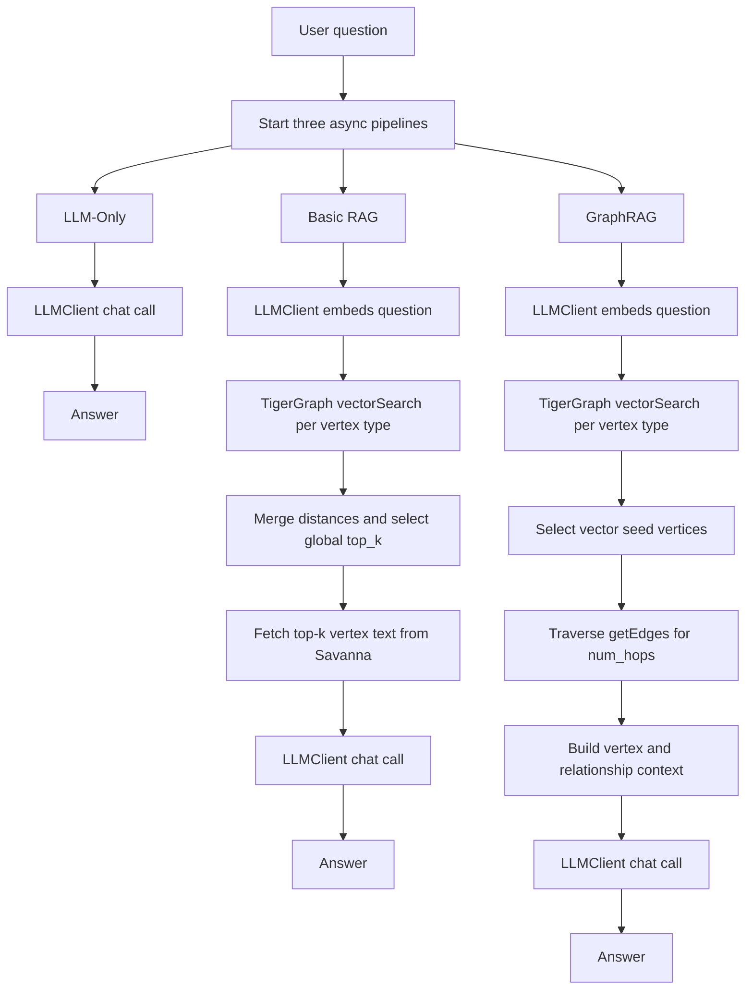

# graphRAG-tiger

GraphRAG pipelines over an existing TigerGraph/Savanna biomedical graph.
The application compares three executions:

- **LLM-Only**: the model answers from its parametric knowledge.
- **Basic RAG**: the question is embedded and searched against native Savanna vector indexes.
- **GraphRAG**: native vector search returns seed vertices, then TigerGraph edges are traversed for additional evidence.

The graph owns document vectors and vector search. The application does not download the full graph or build a local vector store.

## Requirements

- Python 3.14 or newer
- `uv`
- An existing TigerGraph/Savanna graph, or permission to create one
- An OpenAI-compatible embedding and chat endpoint
- A TigerGraph API token with schema, query, vertex, edge, and installed-query access

Install dependencies:

```bash
uv sync --extra dev
```

## Configuration

Create a `.env` file in the repository root:

```dotenv
TG_HOST=https://your-savanna-host
TG_GRAPH=HetionetGraph
TG_API_KEY=your-tigergraph-token

LLM_API_KEY=your-openai-compatible-key
LLM_HOST_URL=https://api.openai.com/v1
```

Optional settings:

```dotenv
# Vertex types searched by Basic RAG and GraphRAG.
TG_VERTEX_TYPES=Anatomy,BiologicalProcess,CellularComponent,Compound,Disease,Gene,MolecularFunction,Pathway,PharmacologicClass,SideEffect,Symptom

# Outgoing edges read for each graph-expansion vertex.
TG_EDGES_PER_VERTEX=25

# Embedding model used by both the embedding loader and question retrieval.
EMBEDDING_MODEL=text-embedding-3-small
```

The embedding model must produce vectors with the same dimension configured in TigerGraph. The default schema and loader use `text-embedding-3-small` with dimension `1536` and cosine distance.

## Data Layout

The source data is under [`tg/data`](tg/data):

```text
tg/data/
  hetionet_schema.gsql
  nodes/*.csv
  edges/*.csv
```

Each node CSV must contain at least:

```text
id,name,text_blob
```

`text_blob` is the text sent to the embedding model. It should contain the entity name, type, and useful descriptive fields.

## Complete Setup

Run the setup steps in this order.

### 1. Create the schema and vector attributes

```bash
uv run python -m tg.load.tg_load --schema
```

This creates the configured graph schema and adds the native `embedding` vector attribute to every configured vertex type. The schema loader does not generate document embeddings.

### 2. Load vertices and edges

For a small sample:

```bash
uv run python -m tg.load.tg_load --load-data --limit 2
```

For a larger sample:

```bash
uv run python -m tg.load.tg_load --load-data --limit 100
```

`--limit` applies independently to each vertex and edge CSV. Edge rows are loaded only when both endpoint vertices are present in the selected vertex sample.

You can combine schema creation and data loading:

```bash
uv run python -m tg.load.tg_load --schema --load-data --limit 100
```

### 3. Generate and load document embeddings

```bash
uv run python -m tg.load.embed_vertices --limit 100
```

Use `--limit 0` to process all rows:

```bash
uv run python -m tg.load.embed_vertices --limit 0
```

This step:

1. Reads `text_blob` from each node CSV.
2. Calls the OpenAI embedding client in batches.
3. Upserts `text_blob` and `embedding` into TigerGraph.
4. Waits for TigerGraph vector indexes to finish rebuilding.

The loader-local client is intentionally separate from the application query client. Embedding generation is a setup/data operation; query-time chat and question embedding use the application LLM client.

### 4. Install persistent vector-search queries

```bash
uv run python -m tg.load.tg_load --install-vector-queries
```

This installs one persistent GSQL query per vertex type, for example:

```text
search_compound_vector
search_disease_vector
search_gene_vector
```

Each query calls TigerGraph native `vectorSearch()` with a question vector and `k`. The runtime uses these installed queries; it does not create or drop queries for every user request.

Reinstalling is safe. The setup removes each known query before recreating it.

### 5. Inspect the graph

```bash
uv run python -m tg.tiger_graph
```

This validates the configured graph and prints vertex counts without changing the graph.

## Run the Application

Start the Streamlit UI:

```bash
uv run streamlit run app.py
```

Then enter a question and click **Run All Pipelines**.

The UI:

- Starts all three pipelines concurrently.
- Shows each pipeline as `Running...`.
- Displays each answer as soon as that pipeline finishes.
- Shows independent failures without cancelling the other pipelines.
- Displays token usage, latency, cost, retrieved context, and response details.

The CLI comparison runs the same three pipelines concurrently:

```bash
uv run python main.py "What compounds treat epilepsy and what are their side effects?"
```

## Query-Time Workflow



### LLM-Only

`tg_llm.api.async_query()` builds the LLM-only prompt and sends it through the centralized `LLMClient` in [`llm/ag_llm.py`](llm/ag_llm.py).

It does not access TigerGraph or embeddings.

### Basic RAG

`tg_rag.api.async_query()` calls the shared async runner in [`llm/rag_pipeline.py`](llm/rag_pipeline.py):

1. Embed the question using `LLMClient.embed()`.
2. Call one installed native vector query per configured vertex type.
3. Merge all returned distances.
4. Sort by nearest distance; lower cosine distance is better.
5. Select the global `top_k` results.
6. Fetch only those vertex records from Savanna.
7. Render `basic_rag.prompty` and call `LLMClient.query()`.

### GraphRAG

`tg_graph_rag.api.async_query()` performs the Basic RAG seed search, then:

1. Uses each seed as a graph frontier.
2. Calls TigerGraph `getEdges()` for each frontier vertex.
3. Repeats for `num_hops`.
4. Filters new vertices using `num_seen_min`.
5. Fetches newly discovered vertex text.
6. Adds explicit relationship chains to the context.
7. Renders `graph_rag.prompty` and calls `LLMClient.query()`.

The `num_seen_min` default is `1`, so a valid direct relationship is not discarded merely because it appears through one path.

## Caching and Performance

The runtime caches reusable resources and retrieval work:

- The shared Savanna retriever is reused within the process.
- LLM clients are cached by model.
- Vertex-type discovery is cached.
- Repeated normalized question and `top_k` retrieval is cached.
- Repeated graph expansion for the same seeds and hop settings is cached.
- Vertex documents fetched from Savanna are cached.
- The UI runs independent pipelines concurrently.

Caches are process-local and in-memory. Restarting Streamlit clears them. If graph data or embeddings change, restart the application to avoid using an old cached result.

## Loader Commands

```bash
# Create schema and vector attributes.
uv run python -m tg.load.tg_load --schema

# Create schema and load a sample.
uv run python -m tg.load.tg_load --schema --load-data --limit 2

# Load data into an existing graph.
uv run python -m tg.load.tg_load --load-data --limit 100

# Generate embeddings for all rows.
uv run python -m tg.load.embed_vertices --limit 0

# Install or reinstall native vector-search queries.
uv run python -m tg.load.tg_load --install-vector-queries

# Drop only the configured graph.
uv run python -m tg.load.tg_load --drop-graph

# Reset all graphs, edge types, and vertex types. Use with care.
uv run python -m tg.load.tg_load --reset-savanna
```

`--reset` drops and recreates the configured graph when used with schema setup:

```bash
uv run python -m tg.load.tg_load --reset --schema --load-data --limit 2
```

## Architecture

```text
app.py                         Minimal Streamlit startup entry point
ui/app.py                      Streamlit UI and progressive result rendering
main.py                        Concurrent CLI benchmark
llm/ag_llm.py                  Central application chat and question-embedding client
llm/rag_pipeline.py           Shared async RAG execution

tg/retrieval.py                Native Savanna vector retrieval and graph expansion
tg/base.py                    Runtime TigerGraph connection
tg/load/tg_load.py             Loader CLI orchestration
tg/load/schema.py              Schema and vector-attribute setup
tg/load/data.py                Vertex and edge loading
tg/load/embed_vertices.py     Synchronous document embedding loader
tg/load/vector_queries.py      Persistent native vector-query installation

tg_llm/                       LLM-only pipeline
tg_rag/                       Basic RAG pipeline and prompt
tg_graph_rag/                 GraphRAG pipeline and prompt
```

## Troubleshooting

### No vector-search query found

Install the persistent queries after schema setup and embeddings:

```bash
uv run python -m tg.load.tg_load --install-vector-queries
```

### Vector index is still rebuilding

Run the embedding loader again or wait for the existing rebuild to finish:

```bash
uv run python -m tg.load.embed_vertices --limit 0
```

### No useful vertices are retrieved

Check all of the following:

- The question embedding model matches the document embedding model.
- The vector dimension is `1536` for the default configuration.
- `TG_VERTEX_TYPES` includes the required entity type.
- The vector queries were installed for every required vertex type.
- The graph contains embeddings for the relevant rows.
- The application was restarted after changing graph data or embeddings.

### GraphRAG context is too large

Reduce:

- `Top-K` in the UI.
- `Graph Hops` in the UI.
- `TG_EDGES_PER_VERTEX` in `.env`.

### GraphRAG misses direct relationships

Keep `Min Seen (GraphRAG)` at `1`. Higher values require a neighboring vertex to be discovered through multiple paths and can remove valid direct evidence.
