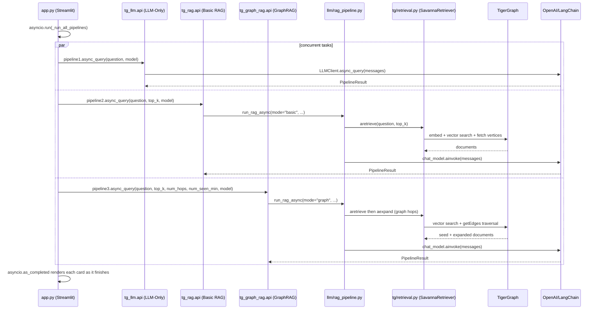

# graphRAG-tiger

Custom LangChain/LangGraph RAG pipelines over an existing TigerGraph Savanna
graph. The RAG application reads an existing graph; the `tg/tg_load.py` utility
can explicitly create, drop, reset, and load the Hetionet schema from the CLI.

## Configuration

```dotenv
TG_HOST=https://your-savanna-host
TG_GRAPH=YourExistingGraph
TG_API_KEY=your-token
LLM_API_KEY=your-openai-compatible-key
LLM_HOST_URL=https://api.openai.com/v1
```

Optional retrieval settings:

- `TG_VERTEX_TYPES`: comma-separated vertex types to search; defaults to all.
- `TG_CANDIDATES_PER_TYPE`: vertices read per type and cached; defaults to 200.
- `TG_EDGES_PER_VERTEX`: outgoing edges read during expansion; defaults to 25.
- `EMBEDDING_MODEL`: embedding model; defaults to `text-embedding-3-small`.

## Run

```bash
uv sync --extra dev
uv run python -m tg.tiger_graph
uv run streamlit run app.py
```

`tg.tiger_graph` only validates the configured graph and reports vertex counts.
Basic RAG performs semantic vertex retrieval. Graph RAG reuses those seeds and
adds bounded multi-hop neighborhood traversal.

## Graph Management

```bash
uv run python tg/tg_load.py --schema
uv run python tg/tg_load.py --limit 2
uv run python tg/tg_load.py --load-data --limit 2
uv run python tg/tg_load.py --limit 2 --reset
uv run python tg/tg_load.py --drop-graph
uv run python tg/tg_load.py --reset-savanna
```

`--limit` loads a small sample per vertex and edge type into an existing graph.
Combine `--schema` or `--reset` with `--limit` to create or recreate the schema
before loading data. `--reset` drops and recreates the configured `TG_GRAPH`.


## Architecture

